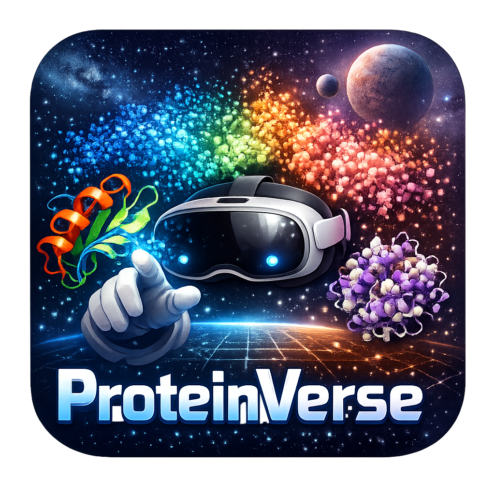

# ProteinVerse

<p align="center">
  
</p>

A virtual reality application for exploring protein structural diversity in immersive 3D space. Built for **Meta Quest 3** using Unity.

Proteins are projected into a shared 3D coordinate space using dimensionality reduction (UMAP, PCA, or t-SNE) applied to a structural similarity matrix, then rendered as an interactive point cloud in VR. Each point is a unique protein — you can reach out, select one, and instantly see its 3D structure, physicochemical properties, and domain architecture floating in front of you.

This app is part of ongoing research developing the **PhaRBP** (Phage Receptor Binding Protein) database — a curated resource for phage receptor binding proteins. Paper coming soon.

---

## Features

- **63 000+ proteins** visualised as a navigable 3D point cloud
- **Select any point** with a hand pinch to open an info panel showing:
  - Sequence ID and basic properties (length, molecular weight, pI, hydropathy, aromaticity)
  - Proportional, colour-coded domain architecture bar with legend
  - Associated protein names and phage hosts
  - Interactive 3D protein structure rendered in-panel
- **Release protein structures** — detach the 3D model from the panel and hold it in your hand, scale it with two hands, recall it back
- **Pin panels** — keep a panel open while you explore other proteins; each pinned panel gets a distinct colour matched to its point in the cloud
- **Move mode** — grab and reposition / rescale the entire point cloud via the watch menu on your wrist
- Hand tracking and controller support

---

## Requirements

| Requirement | Version |
|---|---|
| Unity | 2022.3 LTS or later |
| Meta XR SDK | v57 or later (tested on v85) |
| Target device | Meta Quest 3 |
| Build platform | Android (ARM64) |

> The app requires an internet connection at runtime to fetch protein data and structures from the PhaRBP API.

---

## Getting Started

### 1. Clone the repository

```bash
git clone https://github.com/victornemeth/ProteinVerse.git
cd ProteinVerse
```

### 2. Open in Unity

Open Unity Hub, click **Add project from disk**, and select the cloned folder. Open with **Unity 2022.3 LTS**.

### 3. Install the Meta XR SDK

If the Meta XR packages are not already present:

1. Open **Window → Package Manager**
2. Add the Meta XR All-in-One SDK via the registry or import it from the [Meta Developer Hub](https://developer.oculus.com/downloads/unity/)

### 4. Configure Android build

1. **File → Build Settings** → switch platform to **Android**
2. In **Player Settings**:
   - Set **Minimum API level** to Android 10 (API 29)
   - Enable **IL2CPP** scripting backend
   - Enable **ARM64** architecture
3. Connect your Quest 3 with a USB cable (enable developer mode on the headset first)
4. Click **Build and Run**

### 5. Point cloud data

The app renders a spatially thinned subset of the full UMAP dataset for performance. At runtime it loads `umap_thinned.csv` from `StreamingAssets` — **6,001 points** out of the full 63,934, selected by voxel-grid subsampling (one representative point kept per cell of size ~0.186 UMAP units). This halves GPU vertex count while preserving the overall shape and cluster structure of the embedding.

The full dataset is also included as `umap_coordinates_n15.csv` and is used only to regenerate the thinned file (see `thin_pointcloud.py`).

The CSV format is:

```
UMAP1,UMAP2,UMAP3,Sequence_ID
6.703166,5.8886275,2.9228048,000038f8d21a26c18e677a4a079fc7e8...
...
```

To adjust the thinning density, edit `TARGET` in `thin_pointcloud.py` and re-run it — it will regenerate `umap_thinned.csv` and all color binaries automatically.

To use your own dataset, replace `umap_coordinates_n15.csv` with one that follows the same format and re-run `thin_pointcloud.py`. The `Sequence_ID` column must match the identifiers your API serves.

---

## APIs Used

All protein data is fetched at runtime from the **PhaRBP API** hosted at `pharp.ugent.be`:

| Endpoint | What it returns |
|---|---|
| `GET /api/sequence/{id}/basic/` | Length, molecular weight, pI, hydropathy, aromaticity, source ID |
| `GET /api/sequence/{id}/domains/` | Domain annotations with start/end positions and domain IDs |
| `GET /api/sequence/{id}/proteins/` | Associated protein names, source IDs, and phage host names |
| `GET /static/pdbs/{id}.pdb` | PDB file used to render the 3D protein structure |

The `{id}` is the SHA-256 hash identifier stored in the `Sequence_ID` column of the CSV.

---

## Project Structure

```
Assets/
  Scripts/
    UmapPointCloud.cs      — loads CSV, builds point cloud mesh, handles hand interaction
    PointInfoPanel.cs      — info panel UI: fetches and displays protein data
    ProteinVisualizer.cs   — renders a PDB file as a cartoon protein in VR
    WatchMenu.cs           — wrist palm menu (move mode + color mode toggles)
  Shaders/
    PointCloud.shader      — billboard point shader (constant world-space size)
  Nanover/
    Visualisation/Shader/  — Nanover-derived cartoon protein shaders (hyperballs, splines, etc.)
  StreamingAssets/
    umap_thinned.csv                         — 6 001-point voxel-thinned subset (rendered at runtime)
    umap_coordinates_n15.csv                 — full 63 934-point dataset (used to regenerate thinned)
    color_detection_method_RBPdetect2.bin    — per-point RGB colors: RBPdetect2 evidence
    color_domain_fiber_spike.bin             — per-point RGB colors: tail fiber vs tail spike
    color_domain_spike_detail.bin            — per-point RGB colors: spike enzymatic subtypes
thin_pointcloud.py         — re-thins the full CSV and regenerates all color binaries
gen_color_bins.py          — (legacy) initial color binary download script
```

---

## Generating Your Own Coordinates

The included coordinates were produced from a structural similarity matrix using UMAP with `n_neighbors=15`. Any dimensionality reduction to 3D works as long as you output the CSV in the format above. Example with Python:

```python
import umap
import pandas as pd

# similarity_matrix: square numpy array of pairwise structural similarities
reducer = umap.UMAP(n_components=3, n_neighbors=15, metric="precomputed")
embedding = reducer.fit_transform(1 - similarity_matrix)  # convert similarity → distance

df = pd.DataFrame(embedding, columns=["UMAP1", "UMAP2", "UMAP3"])
df["Sequence_ID"] = sequence_ids
df.to_csv("umap_coordinates_n15.csv", index=False)
```

You can substitute `umap.UMAP` with `sklearn.decomposition.PCA` or `sklearn.manifold.TSNE` with `n_components=3`.

---

## Credits

- 3D protein rendering adapted from **[Nanover](https://github.com/IRL2/nanover-unity)** (cartoon shader pipeline)
- Protein data served by the **PhaRBP** database — Ghent University
- Built with **Meta XR SDK** and **Unity**
